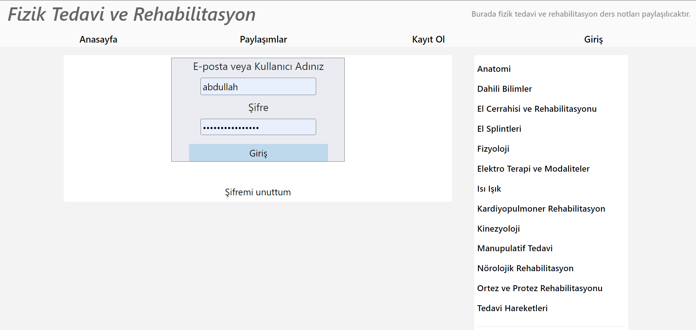
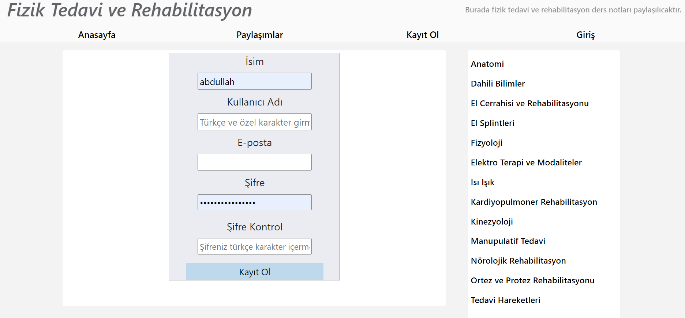
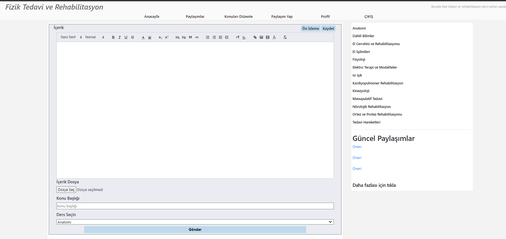
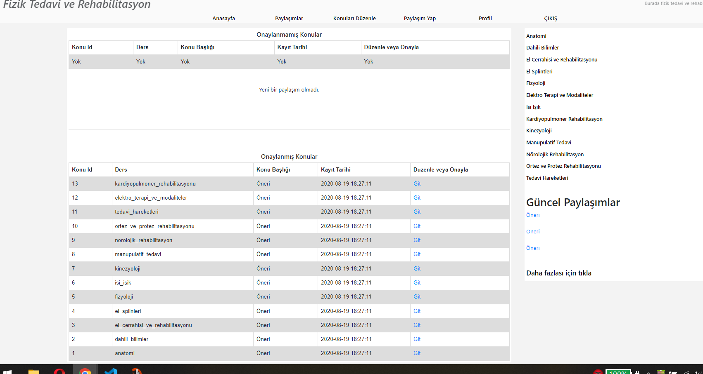
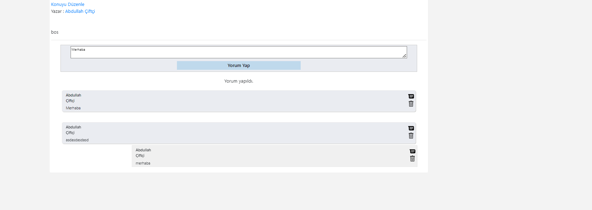
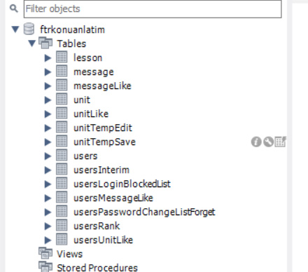

# ftrkonuanlatim.com

    <h2>Proje Hakkında</h2>
    
 
        Bu projemde sunumlarınızı, ders notlarınızı ve bilgilerimizi paylabileceğimiz web sitesidir.
    

    <h3>İçerik</h3>
    Maximum verimlidir. 
    Kullanici adi, eposta, sifre ile kayit olup giris yapabiliyoruz.  
    Yazilari, pdf, word dosyalarini yükleyerek paylaşabiliryoruz. 
    Genel : 
    <ul>
        <li>Kullanıcı oluşturma</li>
        <li>Login olma</li>
        <li>Metin paylaşma</li>
        <li>Dokuman paylaşma</li>
        <li>Paylasimlara yorum yapabilme</li>
        <li>Admin kullanıcısı olup yazıları onaylama, yorumları silme</li>
        <li>Passwordlari encryption  etme</li>
        <li>Oluşan hataları loglama</li>
        <li>Her ay verileri yedekleme</li>
        <li>URL leri düzeltme</li>
        <li>URl leri otomatik mapsleme (sitemap.xml)</li>
        <li>Hizli kurulum ile hızlıca test edebilme</li>
        <li>vb.</li>
    </ul>
     
    <h3>1. Yeni kurulum</h3> 
    Gereken programlar: 
    <ul>
        <li><a href="https://www.docker.com/products/docker-desktop/">Docker</a></li>
    </ul>
    Sırası ile çalıstırın: 
    <code>git clone https://github.com/abdullahciftci034/ftrkonuanlatim.com.git</code>terminalden çalıştırın 
    <code>docker-compose build</code> terminalden çalıştırın 
    <code>docker-compose up</code> terminalden çalıştırın 
    <code><a href="http://localhost/start/1">http://localhost/start/1</a></code> browserda açın 
    <code><a href="http://localhost">http://localhost</a></code>browserda açın 
       
      
    <h3>2. Eski kurulum</h3> 
    Gereken programlar:
    <ul>
        <li><a href="https://git-scm.com/downloads">Git</a></li>
        <li><a href="https://www.wampserver.com/en/">Wamp Server</a></li>
        <li><a href="https://www.apachefriends.org/tr/index.html">Xampp server</a></li>
        <li><a href="https://www.mysql.com/downloads/">Mysql server</a></li>
        <li><a href="https://httpd.apache.org/download.cgi">Apache server</a></li>
    </ul>
    Sirasi ile calistirin: 
    <code>git clone https://github.com/abdullahciftci034/ftrkonuanlatim.com.git</code> 
    <code>apache serverdaki httpd.conf dosyasindan `DocumentRoot` `Directory` konumlari degistirin</code> 
    <code>apache serveri ve mysql calistirin</code> 
    <code>browserdan <a href="http://localhost/start.php">http://localhost/start.php</a> acin</code> 
    <code>browserdan <a href="http://localhost/ftrkonuanlatim">http://localhost/ftrkonuanlatim</a> acin</code>  
     
    <h3>Login olmak için</h3>
    Kullanici adi :abdullahciftci034 
    sifre : abdullah_123 

    
   <h3>Preview</h3>
    
    
    
    
    
    
    

